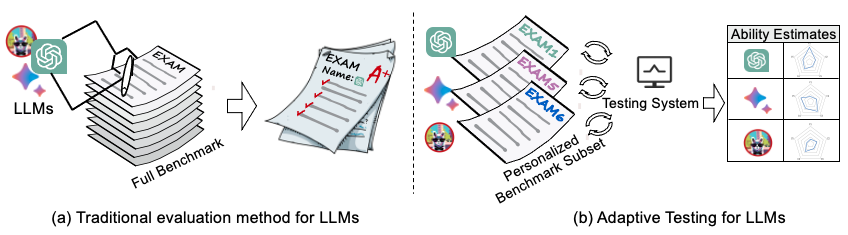
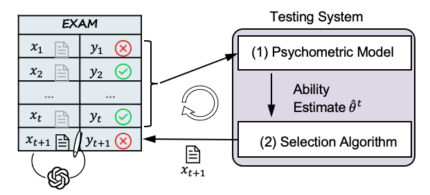

# Adaptive Testing Framework for AI Models

This Python library offers a streamlined solution for rapidly developing an Adaptive Testing system specifically for AI models, particularly large language models (LLMs). Based on psychometrics, it encompasses a comprehensive suite of tools that integrate both traditional statistical methods and recent machine learning and deep learning techniques.

## ❗ What is Adaptive Testing About?


**Computerized Adaptive Testing** stands as one of the earliest and most successful integrations of educational practices and computing technology.  

In evaluating human abilities, psychometrics gradually replaced traditional paper-and-pencil testing with a more advanced approach—-adaptive testing. This approach employs an understanding of cognitive functions and processes to guide the design of assessments, including the measurement of human knowledge, abilities, attitudes, and personality traits. By capturing the characteristics and utility (e.g., difficulty, discrimination) of different items and adjusting the test items in real-time based on the test-taker's performance, adaptive testing avoids overwhelming them with numerous items all at once. Adaptive testing has been widely applied in high-stakes exams such as the Graduate Management Admission Test (GMAT), Graduate Record Examinations (GRE), and the Scholastic Assessment Test (SAT).


<!--  -->
<div style="text-align:center;">
    
</div>


The adaptive system is split into two main components that take turns: At each test step, the psychometric model, as the user model, first uses the model's previous responses to estimate their current ability. Then, the selection algorithm picks the next item from the benchmark according to certain criteria. This two-step process repeats until a predefined stopping rule is met, and the final estimated ability of individual models will be fed back to themselves as the outcome of this assessment or for facilitating future training.

<div style="text-align:center;">
    
</div>
<!--  -->


## Contribution

This repository implements the basic functionalities of adaptive testing. It includes three types of psychometric models: Item Response Theory (IRT), Multidimensional Item Response Theory (MIRT), and Neural Cognitive Diagnosis (NCD). Each psychometric model has its corresponding selection algorithm. This library includes the following models and algorithms:

* Item Response Theory (IRT)
  * MaximumFisherInformation (MFI) strategy
  * Kullback-Leibler Information (KLI) strategy
  * Model-Agnostic Adaptive Testing (MAAT) strategy
* Multidimensional Item Response Theory (MIRT)
  * D-Optimality (D-opt) strategy
  * Multivariate Kullback-Leibler Information (MKLI) strategy
  * Model-Agnostic Adaptive Testing (MAAT) strategy
* Neural Cognitive Diagnosis (NCD)
  * Model-Agnostic Adaptive Testing (MAAT) strategy

## Installation


Git and install by `pip`

```
pip install -e .
```

## Quick Start

See the examples in `scripts` directory.


### Data Preparation

For instance, using the GSM8K benchmark from HELM ([HELM](https://crfm.stanford.edu/helm/classic/latest/)), download the response data for each LLM (Full JSON) and place it in the `data/raw_data` directory.

### Data Processing

To process the data, run the following notebook:

```
scripts/dataset/gsm8k.ipynb
```

### Psychometric Model Training (Item Feature Estimation)

Train the psychometric model by running:

```
scripts/dataset/train.ipynb
```

### Adaptive Testing

For adaptive testing, execute:

```
scripts/dataset/test.ipynb
```


## utils

### Visualization

By default, we use `tensorboard` to help visualize the reward of each iteration, see demos in `scripts` and use

```
tensorboard --logdir /path/to/logs
```

to see the visualization result.


## Data in the Paper

All raw data mentioned in the paper can be found in the `data/experiments` directory, which includes:

- `GSM8K_irt_feature.json`, `MedQA_irt_feature.json`: Estimated IRT features of each item in the GSM8K and MedQA dataset (Figure 2,9,10).
- `guess/`: Guessing factors data for contaminated and uncontaminated items across three benchmarks (MATH, NarrativeQA, RAFT) (Figure 3). Here, 0 indicates no contamination, and 1 indicates contamination.
- `consistency.json`: Rankings consistency data with Full Benchmark.
- `similarity/`: The average Jaccard similarity coefficient data of the selected items for each LLM on the MATH benchmark. The number of selected items increases from 10% to 80% of the entire benchmark.


